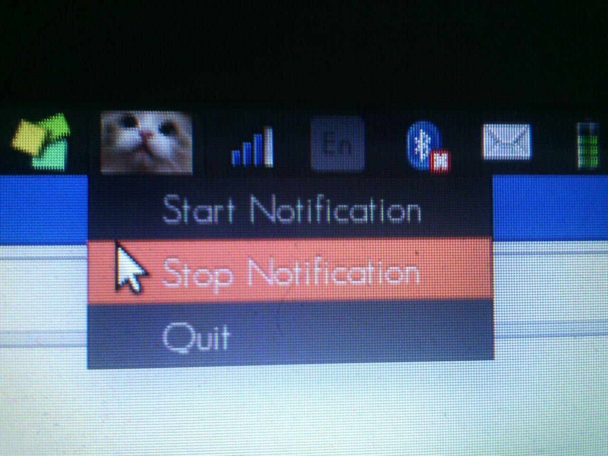

# CAT-preparatory-notification
This is a python based script which notifies the user with new set of words with their meaning and finally take test on those words.

### details  
the whole project can be divided into two parts :  
+ data extraction from the web   
+ UI and Web development.  

&nbsp;&nbsp;&nbsp;&nbsp;&nbsp;&nbsp;&nbsp;&nbsp;&nbsp;&nbsp;&nbsp;&nbsp;&nbsp;&nbsp;&nbsp;&nbsp;&nbsp;&nbsp;&nbsp;&nbsp;&nbsp;&nbsp;&nbsp;&nbsp;&nbsp;&nbsp;&nbsp;&nbsp;&nbsp;&nbsp;&nbsp;&nbsp;&nbsp;&nbsp;&nbsp;&nbsp;&nbsp;&nbsp;&nbsp;&nbsp;&nbsp;&nbsp;&nbsp;&nbsp;&nbsp;&nbsp;&nbsp;&nbsp;&nbsp;&nbsp;&nbsp;&nbsp;&nbsp;&nbsp;&nbsp;&nbsp;&nbsp;&nbsp;&nbsp;&nbsp;&nbsp;&nbsp;&nbsp;&nbsp;&nbsp;&nbsp;&nbsp;&nbsp;&nbsp;&nbsp;&nbsp;&nbsp;&nbsp;&nbsp;&nbsp;   


### data extraction  
first of all I extracted the data from previous year CAT,TOEFL,GRE etc which were spectifically complete the sentence with suitable words.  
Since the raw data is not suitable to be manupulated so, using regular expression I manupulated the whole data, and extracted the meaningful data from it.

so ```sentence complete.txt``` is the raw data  
```code.txt``` can be said as structured data  
```words.txt``` can be said the list of words that I will be using to get the "word meaning" using rest api was generated using ```words.py```  
```words+meaning.csv``` the words and meaning stored which has been extracted using the rest api and the code for meaning extraction can be found in ```words+meaning.py```  
```extract.csv``` the data base of question and the options, was generated using ```extract.py```  

### **UI and Web Developement**  
**task1**  
The first prototype to see if the notification was working was ```words_notification.py``` .  

**task 2**  
Now having seen the notification working I then switched on making the web page for the questions.The thought of the web page was:  
+ to create a page where the questions are hidden
+ onclick question show the question
+ each question has its own timer so being judged by individual questions.
+ On submit show the marks and the answer using javascript. For animation effect used jquery and css.

```check.html``` is the html which is implemented by python using jinja package to create ```code.html``` .
Similarly, ```ori.js``` is implemented to create ```quiz-1.js```  

**task 3**  
having created the notification and the webpage now had to connect the two so as to manage the process so used thread.

so created two major thread   
+ to start the notification pop up which was surrounded by a flag which will state if the notification is on or the test area is on.
+ to maintain a buffer which will store the current positions,which will refresh the buffer after each 2 second.```answer.txt is the buffer.```

one minor thread:  

this was to start the webbrowser as when a call was made to start the webbrowser the script seemed to wait infinitly so I had to call a stoppable thread which can be stopped which was not declared in python had to override the thread class and add own feature.

I made the threads deamon as to ensure that all the threads are closed when the main function ends all the threads ends ,a way to escape create zombie thread  

**task 4**  
the final task was to create the UI which will be interactive with the user so I thought for simple callable functions.
+ start the notification
+ stop the notification
+ quit the whole process

having completed the task deployed by using the start application and can be viewed as an individual application .

### **installation**

Most of the packages are expected to come by default with python but still if the package are not found you can download using  
```pip install <package name> ``` or ```sudo apt-get install python.<package name>``` without "<"and ">"

having done the installation change the address of the files,  
```file_address = '/home/deathnote/Desktop/d/python_project/cat/'```
to your path where the folder is saved.

to **run** ,  
first of all change the permission of the file using chmod,  
```sh
chmod 755 code.py
``` 
to run  

``` 
./code
```
after changing the premission the project will be working perfectly using "startup application" starting at the boot time.  

having done that the project should be up and working.If not please mail me your issue.


