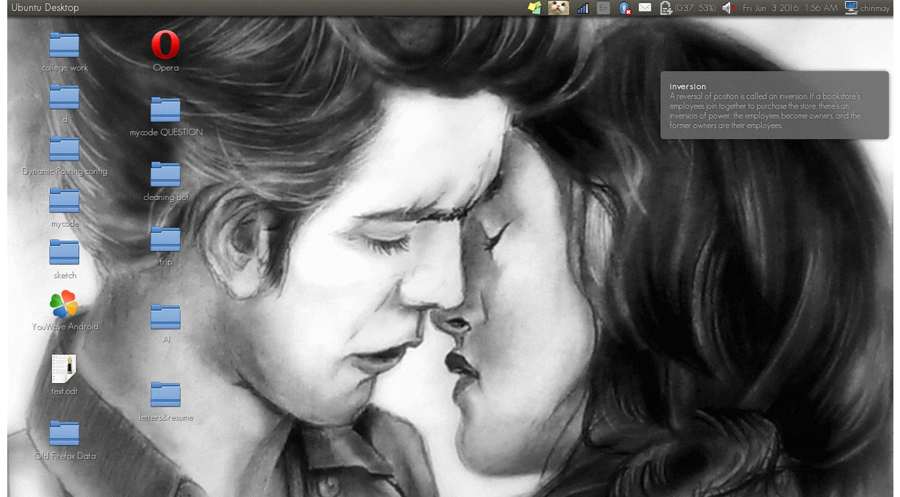

# CAT-preparatory-notification
This is a python based script which notifies the user with new set of words with their meaning and finally take test on those words.

### details  
the whole project can be divided into two parts :  
+ data extraction from the web   
+ UI and Web development.  

&nbsp;&nbsp;&nbsp;&nbsp;&nbsp;&nbsp;&nbsp;&nbsp;&nbsp;&nbsp;&nbsp;&nbsp;&nbsp;&nbsp;&nbsp;&nbsp;&nbsp;&nbsp;&nbsp;&nbsp;&nbsp;&nbsp;&nbsp;&nbsp;&nbsp;&nbsp;&nbsp;&nbsp;&nbsp;&nbsp;&nbsp;&nbsp;&nbsp;&nbsp;&nbsp;&nbsp;&nbsp;&nbsp;&nbsp;&nbsp;&nbsp;&nbsp;&nbsp;&nbsp;&nbsp;&nbsp;&nbsp;&nbsp;&nbsp;&nbsp;&nbsp;&nbsp;&nbsp;&nbsp;&nbsp;&nbsp;&nbsp;&nbsp;&nbsp;&nbsp;&nbsp;&nbsp;&nbsp;&nbsp;&nbsp;&nbsp;&nbsp;&nbsp;&nbsp;&nbsp;   




### data extraction  
first of all I extracted the data from previous year CAT,TOEFL,GRE etc which were spectifically complete the sentence with suitable words.  
Since the raw data is not suitable to be manupulated so, using regular expression I manupulated the whole data, and extracted the meaningful data from it.

so ```sentence complete.txt``` is the raw data  
```code.txt``` can be said as structured data  
```words.txt``` can be said the list of words that I will be using to get the "word meaning" using rest api was generated using ```words.py```  
```words+meaning.csv``` the words and meaning stored which has been extracted using the rest api and the code for meaning extraction can be found in ```words+meaning.py```  
```extract.csv``` the data base of question and the options, was generated using ```extract.py```  

### **UI and Web Developement**  
**task1**  
The first prototype to see if the notification was working was ```words_notification.py``` .  

**task 2**  
Now having seen the notification working I then switched on making the web page for the questions.The thought of the web page was:  
+ to create a page where the questions are hidden
+ onclick question show the question
+ each question has its own timer so being judged by individual questions.
+ On submit show the marks and the answer using javascript. For animation effect used jquery and css.

```check.html``` is the html which is implemented by python using jinja package to create ```code.html``` .
Similarly, ```ori.js``` is implemented to create ```quiz-1.js```  

**task 3**  
having created the notification and the webpage now had to connect the two so as to manage the process so used thread.

so created two major thread   
+ to start the notification pop up which was surrounded by a flag which will state if the notification is on or the test area is on.
+ to maintain a buffer which will store the current positions,which will refresh the buffer after each 2 second.```answer.txt is the buffer.```

one minor thread:  

this was to start the webbrowser as when a call was made to start the webbrowser the script seemed to wait infinitly so I had to call a stoppable thread which can be stopped which was not declared in python had to override the thread class and add own feature.

I made the threads deamon as to ensure that all the threads are closed when the main function ends all the threads ends ,a way to escape create zombie thread  

**task 4**  
the final task was to create the UI which will be interactive with the user so I thought for simple callable functions.
+ start the notification
+ stop the notification
+ quit the whole process

having completed the task deployed by using the start application and can be viewed as an individual application .

### **installation**

Most of the packages are expected to come by default with python but still if the package are not found you can download using  
```pip install <package name> ``` or ```sudo apt-get install python.<package name>``` without "<"and ">"

having done the installation change the address of the files,  
```file_address = '/home/deathnote/Desktop/d/python_project/cat/'```
to your path where the folder is saved.

to **run** ,  
first of all change the permission of the file using chmod,  
```sh
chmod 755 code.py
``` 
to run  

``` 
./code
```
after changing the premission the project will be working perfectly using "startup application" starting at the boot time.  

having done that the project should be up and working.If not please mail me your issue.

<html>
<head>
yo man
<script type="text/javascript" src="js/jquery.js"></script>
<script type="text/javascript" src="js/quiz-1.js"></script>
<link href="css/style.css" rel="stylesheet" type="text/css" />
<script type="text/javascript">
function startTimer(duration, display,checkbox) {
    var timer = duration, minutes, seconds;
    var flag=setInterval(function () {
		minutes = parseInt(timer / 60, 10);
		seconds = parseInt(timer % 60, 10);
		minutes = minutes < 10 ? "0" + minutes : minutes;
		seconds = seconds < 10 ? "0" + seconds : seconds;
		display.textContent = minutes + ":" + seconds;

		if (--timer < 0) {
		    clearInterval(flag)
		    document.getElementById(checkbox+'a').setAttribute("onclick","return false")
		    document.getElementById(checkbox+'b').setAttribute("onclick","return false")
		    document.getElementById(checkbox+'c').setAttribute("onclick","return false")
		    document.getElementById(checkbox+'d').setAttribute("onclick","return false")
		    document.getElementById(checkbox+'e').setAttribute("onclick","return false")
		    document.getElementById(checkbox+'f').setAttribute("onclick","return false")
		}
    }, 1000);
}
function hideshow(now,which,time,checkbox){
	document.getElementById(now).setAttribute("value","1")
	which=document.getElementById(which)
	if (!document.getElementById)
		return;
	
	if(time=='time1')
		{var Minutes = 30	,
		display = document.querySelector('#time1');
		startTimer(Minutes, display,checkbox);
	}
	
	if(time=='time2')
		{var Minutes = 30	,
		display = document.querySelector('#time2');
		startTimer(Minutes, display,checkbox);
	}
	
	if(time=='time3')
		{var Minutes = 30	,
		display = document.querySelector('#time3');
		startTimer(Minutes, display,checkbox);
	}
	
	if(time=='time4')
		{var Minutes = 30	,
		display = document.querySelector('#time4');
		startTimer(Minutes, display,checkbox);
	}
	
	if(time=='time5')
		{var Minutes = 30	,
		display = document.querySelector('#time5');
		startTimer(Minutes, display,checkbox);
	}
	
	if(time=='time6')
		{var Minutes = 30	,
		display = document.querySelector('#time6');
		startTimer(Minutes, display,checkbox);
	}
	
	if(time=='time7')
		{var Minutes = 30	,
		display = document.querySelector('#time7');
		startTimer(Minutes, display,checkbox);
	}
	
	if(time=='time8')
		{var Minutes = 30	,
		display = document.querySelector('#time8');
		startTimer(Minutes, display,checkbox);
	}
	
	if(time=='time9')
		{var Minutes = 30	,
		display = document.querySelector('#time9');
		startTimer(Minutes, display,checkbox);
	}
	
	if(time=='time10')
		{var Minutes = 30	,
		display = document.querySelector('#time10');
		startTimer(Minutes, display,checkbox);
	}
	
	which.style.display="block"
}
</script>
</head>
<body>
<table border="1" style="width: 100%">

<tr><td>
<p id="flip1" onclick="javascript:hideshow('flip1','panel1','time1','q1')" value="0" ><strong>Question 1 :</strong></p>
<div id="panel1"><div id="time1"></div>
<p class="question">To find out what her husband bought for her birthday, Susan
attempted to ______ his family members about his recent shopping
excursions.
</p>        
<ul class="answers">            
<input type="radio" onclick="return true" name="q1" value="a" id="q1a"><label for="q1a">prescribe</label><br/>          
<input type="radio" onclick="return true" name="q1" value="b" id="q1b"><label for="q1b">probe</label><br/>            
<input type="radio" onclick="return true" name="q1" value="c" id="q1c"><label for="q1c">alienate</label><br/>            
<input type="radio" onclick="return true" name="q1" value="d" id="q1d"><label for="q1d">converge</label><br/>
<input type="radio" onclick="return true" name="q1" value="e" id="q1e"><label for="q1e">revere</label><br/>  
<input type="radio" onclick="return true" name="q1" value="f" id="q1f" checked><label for="q1f">none</label><br/> 
</ul> 
<div id= "category1">            
<p>              
The correct ans is 
<strong>

probe

</strong>.</p>        
</div>
</div>
</td>
</tr>
<tr><td>
<p id="flip2" onclick="javascript:hideshow('flip2','panel2','time2','q2')" value="0" ><strong>Question 2 :</strong></p>
<div id="panel2"><div id="time2"></div>
<p class="question">Juan's friends found him in a ______ mood after he learned he
would be homecoming king.
</p>        
<ul class="answers">            
<input type="radio" onclick="return true" name="q2" value="a" id="q2a"><label for="q2a">jovial</label><br/>          
<input type="radio" onclick="return true" name="q2" value="b" id="q2b"><label for="q2b">stealthy</label><br/>            
<input type="radio" onclick="return true" name="q2" value="c" id="q2c"><label for="q2c">paltry</label><br/>            
<input type="radio" onclick="return true" name="q2" value="d" id="q2d"><label for="q2d">gullible</label><br/>
<input type="radio" onclick="return true" name="q2" value="e" id="q2e"><label for="q2e">depleted</label><br/>  
<input type="radio" onclick="return true" name="q2" value="f" id="q2f" checked><label for="q2f">none</label><br/> 
</ul> 
<div id= "category2">            
<p>              
The correct ans is 
<strong>

jovial

</strong>.</p>        
</div>
</div>
</td>
</tr>
<tr><td>
<p id="flip3" onclick="javascript:hideshow('flip3','panel3','time3','q3')" value="0" ><strong>Question 3 :</strong></p>
<div id="panel3"><div id="time3"></div>
<p class="question">His suit of armor made the knight ______ to his enemy's attack,
and he was able to escape safely to his castle.
</p>        
<ul class="answers">            
<input type="radio" onclick="return true" name="q3" value="a" id="q3a"><label for="q3a">vulnerable</label><br/>          
<input type="radio" onclick="return true" name="q3" value="b" id="q3b"><label for="q3b">churlish</label><br/>            
<input type="radio" onclick="return true" name="q3" value="c" id="q3c"><label for="q3c">invulnerable</label><br/>            
<input type="radio" onclick="return true" name="q3" value="d" id="q3d"><label for="q3d">static</label><br/>
<input type="radio" onclick="return true" name="q3" value="e" id="q3e"><label for="q3e">imprudent</label><br/>  
<input type="radio" onclick="return true" name="q3" value="f" id="q3f" checked><label for="q3f">none</label><br/> 
</ul> 
<div id= "category3">            
<p>              
The correct ans is 
<strong>

invulnerable

</strong>.</p>        
</div>
</div>
</td>
</tr>
<tr><td>
<p id="flip4" onclick="javascript:hideshow('flip4','panel4','time4','q4')" value="0" ><strong>Question 4 :</strong></p>
<div id="panel4"><div id="time4"></div>
<p class="question">Choosing a small, fuel-efficient car is a ______ purchase for a
recent college graduate.
</p>        
<ul class="answers">            
<input type="radio" onclick="return true" name="q4" value="a" id="q4a"><label for="q4a">corrupt</label><br/>          
<input type="radio" onclick="return true" name="q4" value="b" id="q4b"><label for="q4b">tedious</label><br/>            
<input type="radio" onclick="return true" name="q4" value="c" id="q4c"><label for="q4c">unhallowed</label><br/>            
<input type="radio" onclick="return true" name="q4" value="d" id="q4d"><label for="q4d">sardonic</label><br/>
<input type="radio" onclick="return true" name="q4" value="e" id="q4e"><label for="q4e">judicious</label><br/>  
<input type="radio" onclick="return true" name="q4" value="f" id="q4f" checked><label for="q4f">none</label><br/> 
</ul> 
<div id= "category4">            
<p>              
The correct ans is 
<strong>

judicious

</strong>.</p>        
</div>
</div>
</td>
</tr>
<tr><td>
<p id="flip5" onclick="javascript:hideshow('flip5','panel5','time5','q5')" value="0" ><strong>Question 5 :</strong></p>
<div id="panel5"><div id="time5"></div>
<p class="question">Such a ______ violation of school policy should be punished by
nothing less than expulsion.
</p>        
<ul class="answers">            
<input type="radio" onclick="return true" name="q5" value="a" id="q5a"><label for="q5a">copious</label><br/>          
<input type="radio" onclick="return true" name="q5" value="b" id="q5b"><label for="q5b">flagrant</label><br/>            
<input type="radio" onclick="return true" name="q5" value="c" id="q5c"><label for="q5c">raucous</label><br/>            
<input type="radio" onclick="return true" name="q5" value="d" id="q5d"><label for="q5d">nominal</label><br/>
<input type="radio" onclick="return true" name="q5" value="e" id="q5e"><label for="q5e">morose</label><br/>  
<input type="radio" onclick="return true" name="q5" value="f" id="q5f" checked><label for="q5f">none</label><br/> 
</ul> 
<div id= "category5">            
<p>              
The correct ans is 
<strong>

flagrant

</strong>.</p>        
</div>
</div>
</td>
</tr>
<tr><td>
<p id="flip6" onclick="javascript:hideshow('flip6','panel6','time6','q6')" value="0" ><strong>Question 6 :</strong></p>
<div id="panel6"><div id="time6"></div>
<p class="question">With all of the recent negative events in her life, she felt ______
forces must be at work.
</p>        
<ul class="answers">            
<input type="radio" onclick="return true" name="q6" value="a" id="q6a"><label for="q6a">resurgent</label><br/>          
<input type="radio" onclick="return true" name="q6" value="b" id="q6b"><label for="q6b">premature</label><br/>            
<input type="radio" onclick="return true" name="q6" value="c" id="q6c"><label for="q6c">malignant</label><br/>            
<input type="radio" onclick="return true" name="q6" value="d" id="q6d"><label for="q6d">punctilious</label><br/>
<input type="radio" onclick="return true" name="q6" value="e" id="q6e"><label for="q6e">antecedent</label><br/>  
<input type="radio" onclick="return true" name="q6" value="f" id="q6f" checked><label for="q6f">none</label><br/> 
</ul> 
<div id= "category6">            
<p>              
The correct ans is 
<strong>

malignant

</strong>.</p>        
</div>
</div>
</td>
</tr>
<tr><td>
<p id="flip7" onclick="javascript:hideshow('flip7','panel7','time7','q7')" value="0" ><strong>Question 7 :</strong></p>
<div id="panel7"><div id="time7"></div>
<p class="question">The ______ rumors did a great deal of damage even though they
turned out to be false.
</p>        
<ul class="answers">            
<input type="radio" onclick="return true" name="q7" value="a" id="q7a"><label for="q7a">bemused</label><br/>          
<input type="radio" onclick="return true" name="q7" value="b" id="q7b"><label for="q7b">prosaic</label><br/>            
<input type="radio" onclick="return true" name="q7" value="c" id="q7c"><label for="q7c">apocryphal</label><br/>            
<input type="radio" onclick="return true" name="q7" value="d" id="q7d"><label for="q7d">ebullient</label><br/>
<input type="radio" onclick="return true" name="q7" value="e" id="q7e"><label for="q7e">tantamount</label><br/>  
<input type="radio" onclick="return true" name="q7" value="f" id="q7f" checked><label for="q7f">none</label><br/> 
</ul> 
<div id= "category7">            
<p>              
The correct ans is 
<strong>

apocryphal

</strong>.</p>        
</div>
</div>
</td>
</tr>
<tr><td>
<p id="flip8" onclick="javascript:hideshow('flip8','panel8','time8','q8')" value="0" ><strong>Question 8 :</strong></p>
<div id="panel8"><div id="time8"></div>
<p class="question">When her schoolwork got to be too much, Pam had a tendency to
______, which always put her further behind.
</p>        
<ul class="answers">            
<input type="radio" onclick="return true" name="q8" value="a" id="q8a"><label for="q8a">dedicate</label><br/>          
<input type="radio" onclick="return true" name="q8" value="b" id="q8b"><label for="q8b">rejuvenate</label><br/>            
<input type="radio" onclick="return true" name="q8" value="c" id="q8c"><label for="q8c">ponder</label><br/>            
<input type="radio" onclick="return true" name="q8" value="d" id="q8d"><label for="q8d">excel</label><br/>
<input type="radio" onclick="return true" name="q8" value="e" id="q8e"><label for="q8e">procrastinate</label><br/>  
<input type="radio" onclick="return true" name="q8" value="f" id="q8f" checked><label for="q8f">none</label><br/> 
</ul> 
<div id= "category8">            
<p>              
The correct ans is 
<strong>

procrastinate

</strong>.</p>        
</div>
</div>
</td>
</tr>
<tr><td>
<p id="flip9" onclick="javascript:hideshow('flip9','panel9','time9','q9')" value="0" ><strong>Question 9 :</strong></p>
<div id="panel9"><div id="time9"></div>
<p class="question">Racha's glance was a ______ invitation to speak later in private
about events of the meeting.
</p>        
<ul class="answers">            
<input type="radio" onclick="return true" name="q9" value="a" id="q9a"><label for="q9a">trecherous</label><br/>          
<input type="radio" onclick="return true" name="q9" value="b" id="q9b"><label for="q9b">scintillating</label><br/>            
<input type="radio" onclick="return true" name="q9" value="c" id="q9c"><label for="q9c">tactful</label><br/>            
<input type="radio" onclick="return true" name="q9" value="d" id="q9d"><label for="q9d">tacit</label><br/>
<input type="radio" onclick="return true" name="q9" value="e" id="q9e"><label for="q9e">taboo</label><br/>  
<input type="radio" onclick="return true" name="q9" value="f" id="q9f" checked><label for="q9f">none</label><br/> 
</ul> 
<div id= "category9">            
<p>              
The correct ans is 
<strong>

tactful

</strong>.</p>        
</div>
</div>
</td>
</tr>
<tr><td>
<p id="flip10" onclick="javascript:hideshow('flip10','panel10','time10','q10')" value="0" ><strong>Question 10 :</strong></p>
<div id="panel10"><div id="time10"></div>
<p class="question">She reached the ______ of her career with her fourth novel, which
won the Pulitzer Prize.
</p>        
<ul class="answers">            
<input type="radio" onclick="return true" name="q10" value="a" id="q10a"><label for="q10a">harbinger</label><br/>          
<input type="radio" onclick="return true" name="q10" value="b" id="q10b"><label for="q10b">apogee</label><br/>            
<input type="radio" onclick="return true" name="q10" value="c" id="q10c"><label for="q10c">metamorphosis</label><br/>            
<input type="radio" onclick="return true" name="q10" value="d" id="q10d"><label for="q10d">dictum</label><br/>
<input type="radio" onclick="return true" name="q10" value="e" id="q10e"><label for="q10e">synthesis</label><br/>  
<input type="radio" onclick="return true" name="q10" value="f" id="q10f" checked><label for="q10f">none</label><br/> 
</ul> 
<div id= "category10">            
<p>              
The correct ans is 
<strong>

apogee

</strong>.</p>        
</div>
</div>
</td>
</tr>
</table>
<br/>
<div id="results">            
Show me the anss!       
</div>                   

<div id="category11">            
<p>                
You ansed them all right!</p>        
</div>

</body>
</html>


